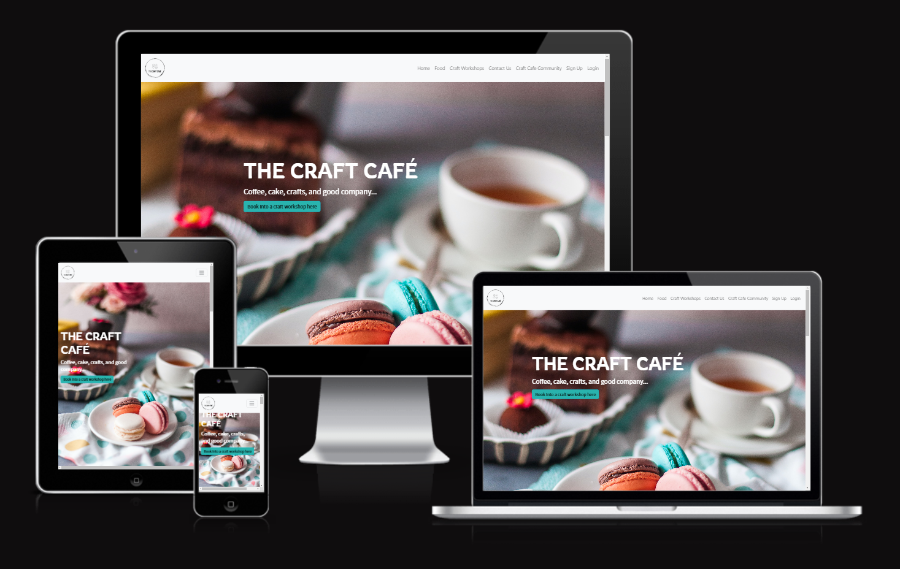
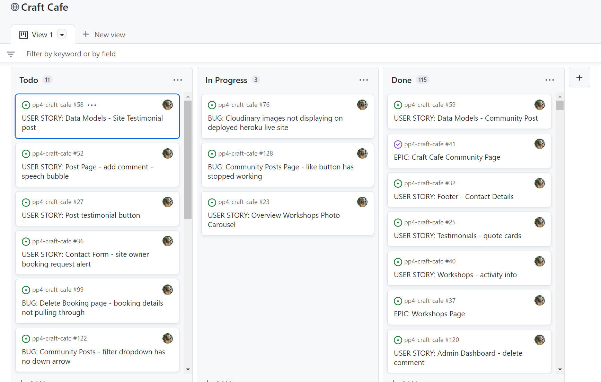

# **The Craft Café**

The Craft Café is a regular café where people can go to enjoy a cup of coffee and a piece of cake. However, it's unique selling point is that in the afternoons, Monday to Friday, and on Saturday mornings, it also runs Craft workshops where people can learn crafty skills and make beautiful craft items to take away. Through the Craft Cafe website, users can check the craft workshop schedule, and reserve their places in advance. 

This fictional site was created for Portfolio Project #4 (Full-Stack Toolkit) - Diploma in Full Stack Software Development Diploma at the [Code Institute](https://www.codeinstitute.net).

[View live website here](https://craft-cafe.herokuapp.com/)

# Table of Content

* [**Project**](<#project>)
    * [Objective](<#objective>)
    * [Site Users Goal](<#site-users-goal>)
    * [Site Owners Goal](<#site-owners-goal>)
    * [Project Management](<#project-management>)

* [**User Experience (UX)**](<#user-experience-ux>)
    * [Wireframes](<#wireframes>)
    * [User Stories](<#user-stories>)
    * [Site Structure](<#site-structure>)
    * [Design Choices](<#design-choices>)

* [**Existing Features**](<#existing-features>)
    * [Navigation](<#navigation>)
    * [About](<#about>)
    * [All](<#all>)
    * [Albums](<#albums>)
    * [Concerts](<#concerts>)
    * [Review Detail View](<#review-detail-view>)
    * [Update / Delete Comment](<#update-and-delete-comment>)
    * [Member Reviews](<#member-reviews>)
    * [Create Review](<#create-review>)
    * [Update Review](<#update-review>)
    * [Profile Page](<#profile-page>)
    * [Admin Area](<#admin-area>)
    * [Sign Up](<#sign-up>)
    * [Sign In](<#sign-in>)
    * [Sign Out](<#sign-out>)
    * [Footer](<#footer>)
    * [Flash Messages](<#flash-messages-and-confirmation-pages-to-the-user>)

* [**Features Left To Implement**](<#features-left-to-implement>)

* [**Technologies Used**](<#technologies-used>)
    * [Languages](<#languages>)
    * [Frameworks & Software](<#frameworks--software>)
    * [Libraries](<#libraries>)

* [**Testing**](<#testing>)
    * [Testing User Stories](<#testing-user-stories>)
    * [Code Validation](<#code-validation>)
    * [Additional Testing](<#additional-testing>)
    * [Known Bugs](<#known-bugs>)
* [Deployment](<#deployment>)
* [Credits](<#credits>)
* [Acknowledgements](<#acknowledgements>)

# **Project**

## Objective
I absolutely love crafting, both with my children, and as a personal hobby. I make patchwork quilts to relax and disconnect from work. It would be dream of mine to set up a craft café, where people could go to socialise through craft activities, and gain valuable crafting expertise at the same time. Based on the project 4 scope requirements, I was given the opportunity to build a site for this dream café.

## Site Users Goal
This café gives other like-minded craft enthusiasts the opportunity to meet each other and interact through a common shared hobby.

## Site Owners Goal
The goal of the site owner is to deliver a site where the users who share a passion for craft and creating can meet eachother through the craft workshops, and also share their creations with eachother by posting photos and comments.

## Project Management

### Github Project Board
I've been using the project board in GitHub to keep my project together. In the initial design phase, it was really helpful to plan the project as a whole, and create the user stories based on my wireframe designs. I created an Epic for each main html page with bullet points for the main desired features. Then, I created a linked User Story for each feature and gave it a level of prioritization using the MoSCoW method and a number of User Story points to indicate the level of difficulty for that feature. 

Later on, during the build, I also used the Project Board to log and track bugs found in my code which could not be fixed immmediately. 

[Back to top](<#table-of-content>)

### Database Schema

Models used (besides standard AllAuth user model) in this project are:

* **Post** - Handles all the posts
* **Comment** - Handles all the comments
* **WorkshopBooking** - Handles the workshop bookings 

# **User Experience (UX)**

## Wireframes
The wireframes for the site were created in the software [Balsamiq](https://balsamiq.com). The wireframes have been created for desktop, tablet and mobile devices. The text content wasn't finalized during the wireframe process. I used it mainly to design the grid system layout and button features for each page. Any differences are down to design choices that were made during the build process.

<b>Wireframes</b>

 

## User Stories
Here I have listed the main user stories for three types of user. A normal user not logged in, a logged in user and a logged in superuser with administration access to the site. These user stories were then tested and confirmed in the [Testing](<#testing>) section.

### Logged Out Site User
|  | | |
|:-------:|:--------|:--------|
| As a Site User | I can log in so that I can interact fully with the site | &check; |
| As a New User | I can sign up so that I can interact fully with the site | &check; |
| As a Site User | I can log out from the site so that no-one else can interact with the site using my details | &check; |
| As a Site User | I can view the café menu | &check; |
| As a Site User | I can view the craft workshop schedule | &check; |

### Logged In Site User
|  | | |
|:-------:|:--------|:--------|
| As a Site User | I can log in so that I can interact fully with the site | &check; |
| As a Site User | I can log out from the site so that no-one else can interact with the site using my details | &check; |
| As a Site User | I can view community craft posts | &check;
| As a Site User | I can view the number of likes on each post so that I can see how popular a specific post is | &check; |
| As a Site User | I can view the number of comments on each post so that I can see how popular a specific post is | &check; |
| As a Site User | I can create a new post so that I can contribute to the craft cafe community | &check; | 
| As a Site User | I can edit any of my posts so that I can amend any errors or add missing information | &check; | 
| As a Site User | I can delete any of my posts so that I can remove unwanted posts from the craft cafe community | &check; | 
| As a Site User | I can create a new comment on an existing post so that I can comment on other user's posts | &check; | 
| As a Site User | I can like an existing post so that I can show my appreciation for other user's posts | &check; |
| As a Site User | I can remove a like from an existing post so that I can remove my appreciation for other user's posts | &check; |
| As a Site User | I can view comments on a specific post so that I can see other user's opinions of the posts | &check; |
| As a Site User | I can add comments on a specific post so that I can give my opinion on other user's posts | &check; |
| As a Site User | I can edit my comments on a specific post so that I can change my opinion on other user's posts | &check; |
| As a Site User | I can delete my comments on a specific post so that I can remove my opinion on other user's posts | &check; |
| As a Site User | I can view a list of all posts I have made on the site | &check; |
| As a Site User | I can view a list of all comments I have made on the site | &check; |
| As a Site User | I can create a workshop booking so that I can reserve a place on a workshop | &check; |
| As a Site User | I can edit a workshop booking so that I can change an existing reservation on a workshop | &check; |
| As a Site User | I can delete a workshop booking so that I can cancel an existing reservation on a workshop | &check; |
| As a Site User | I can view a list of all workshop bookings I have made on the site | &check; |

### Site Admin

|  | | |
|:-------:|:--------|:--------|
| As a Site Admin | I can log out from the site so that I can feel safe that nobody can access my information | &check; |
| As a Site Admin | I can create, read, update and delete reviews so that I can manage my review content | &check; |
| As a Site Admin | I can approve reviews so that I can secure high quality of the content | &check; |
| As a Site Admin | I can approve and disapprove comments so that I can secure a safe environment for the Site Users | &check; |
| As a Site Admin | I can create draft reviews so that I can finish writing the content later | &check; |
| As a Site Admin | I can access an admin area so that I can get a general understanding of logged in users, number of likes and number of posts | &check; |
| As a Site Admin | I can get visual feedback when interacting with the content so that I can be sure how I have interacted with the page | &check; |

[Back to top](<#table-of-content>)

## Site Structure

The Review | Alliance site is split up in two parts: **when the user is logged out** and **when the user is logged in**. Depending on login status different pages is available for the user. When the user is logged out the pages: *about*, *all*, *albums*, *concerts* are avaliable. When the user is logged in *about*, *all*, *albums*, *concerts*, *create review*, *view my reviews* and *show profile page* are available. If you are logged in as an administrator an *admin area* is available. The site has an minimalistic, clean and intuitive design that makes the site easy to navigate for the user.

Read more about the different choices in the [Features](<#features>) section.

[Back to top](<#table-of-content>)

## Design Choices

* ### Color Scheme

The color scheme chosen for the 'Review | Alliance' site was based on the Bootstrap dark background. The colors are Black (used on some text elements), Raisin Black (top navigation and footer), Rocket Metallic (used on some of the text elements), Cultured (used very rarely in this project) and White (used i.e. as background and card background). All colors are very clean and they create a professional look together and offers a good readability and contrast as well. I used the online service [Coolors](https://coolors.co/) to choose the color scheme.

* ### Typography
The fonts used for the site are 'Roboto' and 'Tinos'. Fallback font for both of them is sans-serif.

* 'Roboto' is used on all headlines including the brand logo. It's a very clean font that works really well for headlines and logos. It's easy to read and matches the minimalistic style that I wanted the site to 'breath'.

* 'Tinos' was chosen for the review excerpt and the review full text. It has a nice serif design and works really well for longer paragraphs of text.

[Back to top](<#table-of-content>)