# **The Craft Café**

The Craft Café is a regular café where people can go to enjoy a cup of coffee and a piece of cake. However, it's unique selling point is that in the afternoons, Monday to Friday, and on Saturday mornings, it also runs Craft workshops where people can learn crafty skills and make beautiful craft items to take away. Through the Craft Cafe website, users can check the craft workshop schedule, and reserve their places in advance. 

This fictional site was created for Portfolio Project #4 (Full-Stack Toolkit) - Diploma in Full Stack Software Development Diploma at the [Code Institute](https://www.codeinstitute.net).

[View live website here](https://craft-cafe.herokuapp.com/)

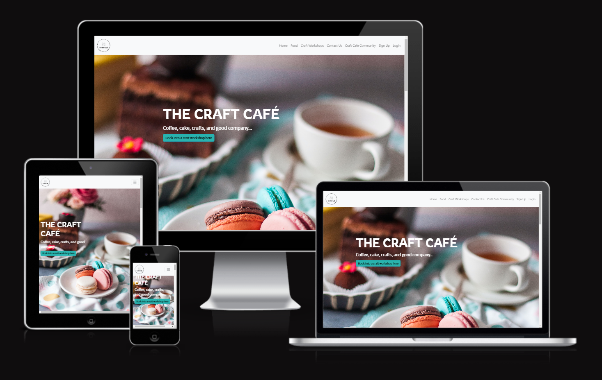

# Table of Content

* [**Project**](<#project>)
    * [Objective](<#objective>)
    * [Site Users Goal](<#site-users-goal>)
    * [Site Owners Goal](<#site-owners-goal>)
    * [Project Management](<#project-management>)

* [**User Experience (UX)**](<#user-experience-ux>)
    * [Wireframes](<#wireframes>)
    * [User Stories](<#user-stories>)
    * [Site Structure](<#site-structure>)
    * [Design Choices](<#design-choices>)

* [**Existing Features**](<#existing-features>)
    * [Navigation](<#navigation>)
    * [Hero Image](<#hero-image>)
    * [Craft Cafe Menu](<#craft-cafe-menu>)
    * [Workshops Overview](<#workshops-overview>)
    * [Reviews](<#reviews>)
    * [Map](<#map>)
    * [Craft Workshops](<#craft-workshops>)
    * [Booking Form](<#booking-form>)
    * [Craft Cafe Community](<#craft-cafe-community>)
    * [Post Details Page](<#post-details-page>)
    * [Profile Page](<#profile-page>)
    * [Admin Dashboard](<#admin-dashboard>)
    * [Sign Up](<#sign-up>)
    * [Sign In](<#sign-in>)
    * [Sign Out](<#sign-out>)
    * [Footer](<#footer>)
    * [Flash Messages](<#flash-messages>)

* [**Features Left To Implement**](<#features-left-to-implement>)

* [**Technologies Used**](<#technologies-used>)
    * [Languages](<#languages>)
    * [Frameworks & Software](<#frameworks--software>)
    * [Libraries](<#libraries>)

* [**Testing**](<#testing>)
    * [Testing User Stories](<#testing-user-stories>)
    * [Code Validation](<#code-validation>)
    * [Additional Testing](<#additional-testing>)
    * [Known Bugs](<#known-bugs>)
* [Deployment](<#deployment>)
* [Credits](<#credits>)
* [Acknowledgements](<#acknowledgements>)

# **Project**

## Objective
I absolutely love crafting, both with my children, and as a personal hobby. I make patchwork quilts to relax and disconnect from work. It would be dream of mine to set up a craft café, where people could go to socialise through craft activities, and gain valuable crafting expertise at the same time. Based on the project 4 scope requirements, I was given the opportunity to build a site for this dream café.

## Site Users Goal
This café gives other like-minded craft enthusiasts the opportunity to meet each other and interact through a common shared hobby.

## Site Owners Goal
The goal of the site owner is to deliver a site where the users who share a passion for craft and creating can meet eachother through the craft workshops, and also share their creations with eachother by posting photos and comments.

## Project Management

### Github Project Board
I've been using the project board in GitHub to keep my project together. In the initial design phase, it was really helpful to plan the project as a whole, and create the user stories based on my wireframe designs. I created an Epic for each main html page with bullet points for the main desired features. Then, I created a linked User Story for each feature and gave it a level of prioritization using the MoSCoW method and a number of User Story points to indicate the level of difficulty for that feature. 

Later on, during the build, I also used the Project Board to log and track bugs found in my code which could not be fixed immmediately. 

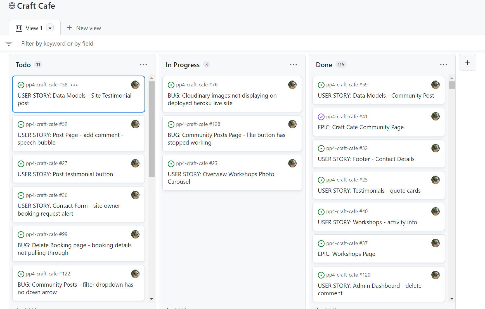

[Back to top](<#table-of-content>)

### Database Schema

Models used (besides standard AllAuth user model) in this project are:

* **Post** - Handles all the posts
* **Comment** - Handles all the comments
* **WorkshopBooking** - Handles the workshop bookings 

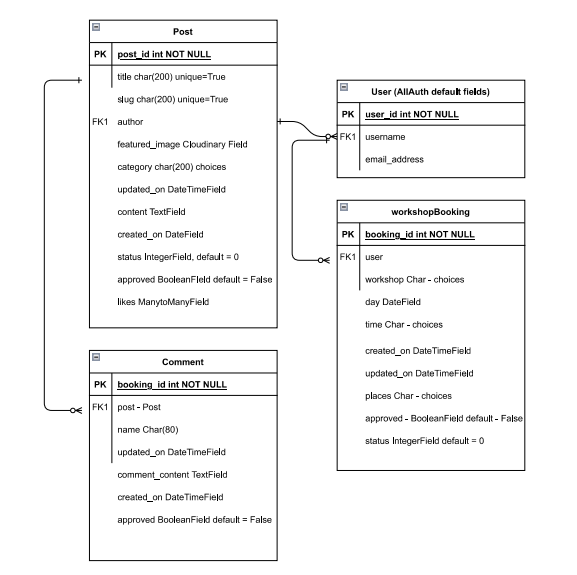

# **User Experience (UX)**

## Wireframes
The wireframes for the site were created in the software [Balsamiq](https://balsamiq.com). The wireframes have been created for desktop, tablet and mobile devices. The text content wasn't finalized during the wireframe process. I used it mainly to design the grid system layout and button features for each page. Any differences are down to design choices that were made during the build process.

<b>Wireframes</b>

 

## User Stories
Here I have listed the main user stories for three types of user. A normal user not logged in, a logged in user and a logged in superuser with administration access to the site. These user stories were then tested and confirmed in the [Testing](<#testing>) section.

### Logged Out Site User
|  | | |
|:-------:|:--------|:--------|
| As a Site User | I can log in so that I can interact fully with the site | &check; |
| As a New User | I can sign up so that I can interact fully with the site | &check; |
| As a Site User | I can log out from the site so that no-one else can interact with the site using my details | &check; |
| As a Site User | I can view the café menu | &check; |
| As a Site User | I can view the craft workshop schedule | &check; |

### Logged In Site User
|  | | |
|:-------:|:--------|:--------|
| As a Site User | I can log in so that I can interact fully with the site | &check; |
| As a Site User | I can log out from the site so that no-one else can interact with the site using my details | &check; |
| As a Site User | I can view community craft posts so that I can see photos of all the craft user's creations | &check;
| As a Site User | I can filter the community craft posts so that I can see posts which relate to my favourite craft category | &check;
| As a Site User | I can view the number of likes on each post so that I can see how popular a specific post is | &check; |
| As a Site User | I can view the number of comments on each post so that I can see how popular a specific post is | &check; |
| As a Site User | I can create a new post so that I can contribute to the craft cafe community | &check; | 
| As a Site User | I can edit any of my posts so that I can amend any errors or add missing information | &check; | 
| As a Site User | I can delete any of my posts so that I can remove unwanted posts from the craft cafe community | &check; | 
| As a Site User | I can create a new comment on an existing post so that I can comment on other user's posts | &check; | 
| As a Site User | I can like an existing post so that I can show my appreciation for other user's posts | &check; |
| As a Site User | I can remove a like from an existing post so that I can remove my appreciation for other user's posts | &check; |
| As a Site User | I can view comments on a specific post so that I can see other user's opinions of the posts | &check; |
| As a Site User | I can add comments on a specific post so that I can give my opinion on other user's posts | &check; |
| As a Site User | I can edit my comments on a specific post so that I can change my opinion on other user's posts | &check; |
| As a Site User | I can delete my comments on a specific post so that I can remove my opinion on other user's posts | &check; |
| As a Site User | I can view a list of all posts I have made on the site so that I can see all the posts I have contributed to the craft cafe community| &check; |
| As a Site User | I can view a list of all comments I have made on the site | &check; |
| As a Site User | I can create a workshop booking so that I can reserve a place on a workshop | &check; |
| As a Site User | I can edit my workshop bookings so that I can change an existing reservation on a workshop | &check; |
| As a Site User | I can delete my workshop bookings so that I can cancel an existing reservation on a workshop | &check; |
| As a Site User | I can view a list of all workshop bookings I have made on the site so that I can see all the workshop activities I have booked in the past and future | &check; |
| As a Site User | I can delete my user account so that I can no longer be part of the craft community if I don't want to | &check; |

### Site Admin

|  | | |
|:-------:|:--------|:--------|
| As a Super User | I can log in so that I can interact fully with the site | &check; |
| As a Super User | I can log out from the site so that no-one else can interact with the site using my details | &check; |
| As a Super User | I can view community craft posts | &check;
| As a Super User | I can view the number of likes on each post so that I can see how popular a specific post is | &check; |
| As a Super User | I can view the number of comments on each post so that I can see how popular a specific post is | &check; |
| As a Super User | I can create a new post so that I can contribute to the craft cafe community | &check; | 
| As a Super User | I can edit any posts so that I can amend any errors or add missing information | &check; | 
| As a Super User | I can delete any posts so that I can remove unwanted posts from the craft cafe community | &check; |
| As a Super User | I can approve posts so that they are published on the craft cafe community | &check; |
| As a Super User | I can create a new comment on an existing post so that I can comment on other user's posts | &check; | 
| As a Super User | I can like an existing post so that I can show my appreciation for other user's posts | &check; |
| As a Super User | I can remove a like from an existing post so that I can remove my appreciation for other user's posts | &check; |
| As a Super User | I can view comments on a specific post so that I can see other user's opinions of the posts | &check; |
| As a Super User | I can add comments on a specific post so that I can give my opinion on other user's posts | &check; |
| As a Super User | I can edit any comments made by other users so that I can amend any comments that are not deemed appropriate | &check; |
| As a Super User | I can delete any comments made by other users so that I can remove any inappropriate comments | &check; |
| As a Super User | I can approve comments so that they are published on the craft cafe community | &check; |
| As a Super User | I can view a list of all posts made on the site so that I can see all the posts users have contributed to the craft cafe community| &check; |
| As a Super User | I can view a list of all comments made on the site so that I can see all the comments users have contributed to the craft cafe community | &check; |
| As a Super User | I can create a workshop booking so that I can reserve a place on a workshop for myself or on behalf on another user| &check; |
| As a Super User | I can edit any workshop booking so that I can change an existing reservation | &check; |
| As a Super User | I can delete any workshop booking so that I can cancel an existing reservation | &check; |
| As a Super User | I can approve workshop bookings so that users know their booking has been confirmed | &check; |
| As a Super User | I can view a list of all workshop bookings all users have made on the site so that I can see all the workshop activities in the past and future | &check; |
| As a Super User | I can delete any user account so that I can remove unwanted users from the craft cafe community | &check; |

[Back to top](<#table-of-content>)

## Site Structure

The Craft Café site is split up in two parts: **when the user is logged out** and **when the user is logged in**. Depending on login status different pages are available for the user. When the user is logged out the pages: *Home*, *Food*, and *Craft Workshops* are avaliable from the Navigation Bar menu. When the user is logged in *Contact Us*, *Craft Cafe Community*, and *Profile Page* are available. If you are logged in as an administrator an *admin* dashboard page is also available. The site is intuitive and prompts the user to sign in if they try to access areas which require a user profile.

Read more about the different choices in the [Features](<#features>) section.

[Back to top](<#table-of-content>)

## Design Choices

* ### Color Scheme

The color scheme chosen for the Craft Café site was based on the tones of the homepage hero background image. I was browsing for café images that were light and bright, as a lot of them are based on brown coffee tones, which I was not keen on for the dual craft aspect of the site. The background image I found has brightly coloured macaroons presented on a piece of decorated table cloth.  I used the online service [Canva](https://www.canva.com/colors/color-wheel/) to build a color palette for the site based on the tones in this photo.

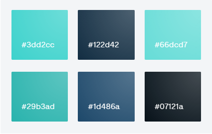

* ### Typography
The main fonts used for the site are 'Rowdies' with a fallback font of cursive and 'Noto Sans JP' with a fallback font of sans-serif.

* 'Rowdies' is used on the H1 and H2 headers . It's a very clean font that works really well in upper case. 

* 'Noto Sans JP' was chosen for the main body and text sections of the site. It's tidy and easy to read.

* 'Dancing Script' was used for the café menu as I preferred a more Italic font for this section.

* 'Luckiest Guy' was used for the Craft Workshop Categories on the Homepage, as I wanted something bold, but at the same time fun to represent the creative side of the café.

<b>Fonts</b>

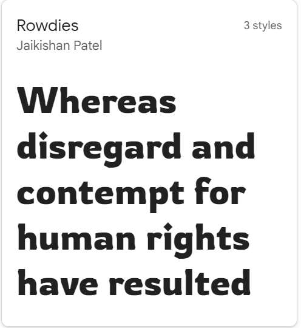

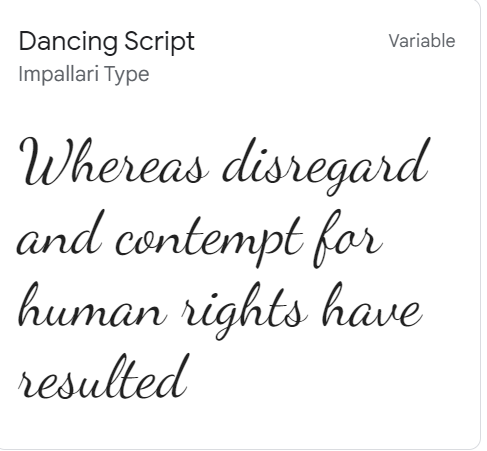

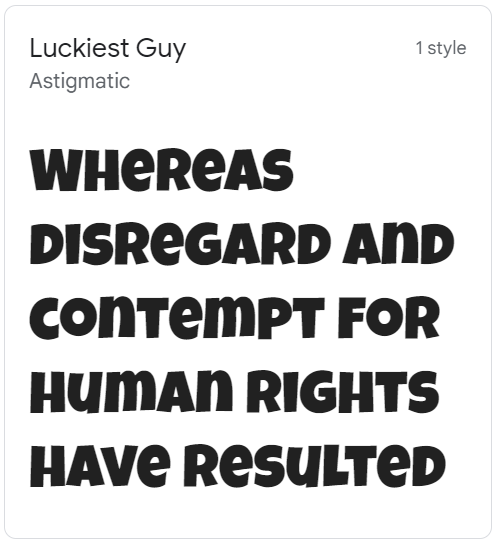

 

[Back to top](<#table-of-content>)

# **Features**
The main features of the site are listed below.

## **Existing Features**

### **Navigation**

The navigation bar is very clean and straight forward. Depending if you are logged in or not different menus are visible for the site user. An extra menu item is visible if you are logged in as an administrator.

For tablet and mobile devices, the navigation bar menu turns into a hamburger dropdown list.

*Links that are visible to logged out users*

* Craft Café Logo - On the far left hand side of the navigation bar is the Craft Cafe brand logo. This is visible throughout the site to all user types and contains a link back to the homepage.
* Home - The first menu item listed 'Home' takes the user to the main 'index.html' page with all the general site information listed.
* Food - This link takes the user down the homepage to the 'Menu' section where lists of food and pricing can be found.
* Craft Workshops - This lists the afternoon craft workshop schedule, and a description and pricing for each activity.
* Sign Up - Directs non-community users to create an account.
* Login - Gives the user the opportunity to log in or sign up if not ready a registered user.

<b>Navigation - User Not Logged In</b>

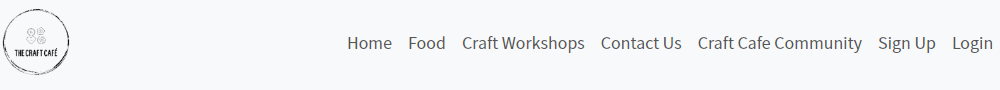

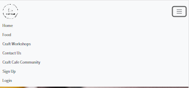

 

*Links that are visible to logged in users*

Additional links which are available to logged in users are as follows:

* Contact Us - Lets the user make a booking request for a craft workshop.
* Craft Café Community - Shows all craft café community posts.
* Log Out - Logs out the user.
* Profile Page - Shows logged in users personal profile page.

<b>Navigation - User Logged In</b>

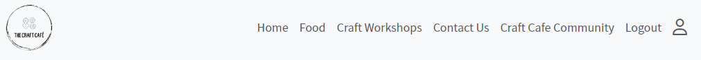

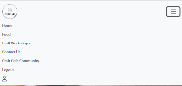

 

*Link that is visible if user is administrator*

If the user is a superuser, they have one additional menu item available.

* Admin Dashboard - A frontend overview of information regarding the website.

<b>Navigation - Admin Logged In</b>

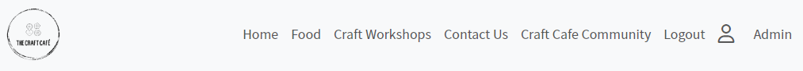

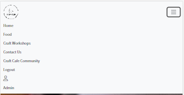

 

### **Hero Image**

If you click on 'Home' from the navigation bar menu or on the brand logo found at the top and bottom of every page, you are redirected to the HomePage. The first thing you see is a full screen hero image of coffee and cakes and a large Jumbotron Title for The Craft Café. Below the Cafe Title is a description telling the user about it's unique selling points; Coffee, cake crafts and good company. From the hero callout, you can click directly to the workshops page where there is more information about the craft activites and the booking form for logged on users. 

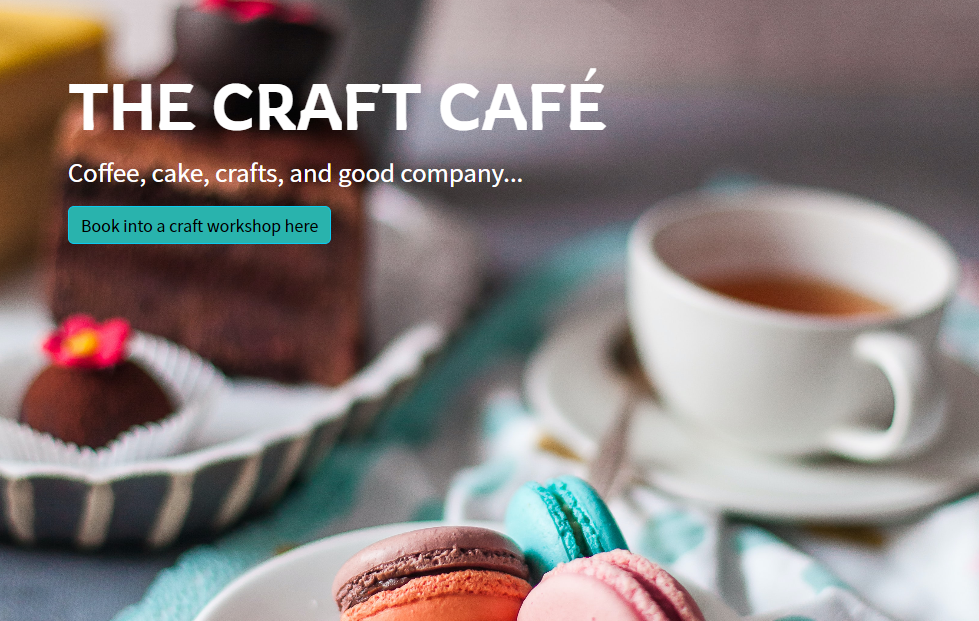

### **Craft Cafe Menu**

The menu is split into three sections. Food, Drinks, and Desserts. On a desktop device, all three menus are displayed alongside eachother in one row. For tablets, the Desserts section drops down into a centred second row, and for mobile devices, the three menus are displayed one at a time below eachother. Each menu has an accompanying image which fits in with the site colour palette and creative theme, and then the available food items and respective prices are shown in a list under each Menu heading. 

<b>Menu</b>

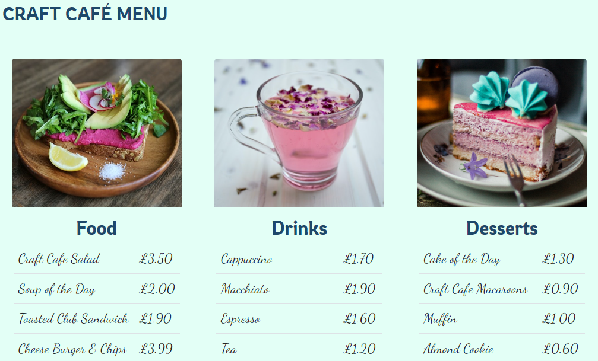

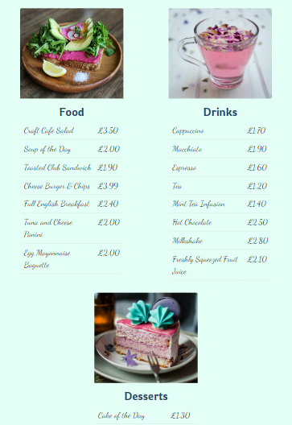

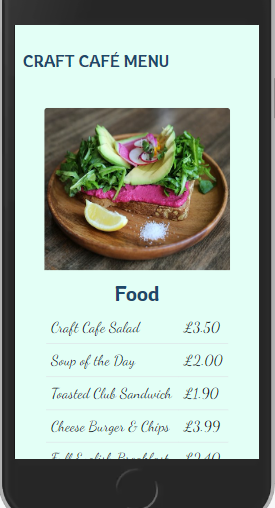

 

### **Workshops Overview**

Scrolling down past the menu on the homepage, the user will find an overview of all the craft workshops held in the Craft Café. Each card has a background image displaying an example of the craft category and a clickable title which takes the user into the 'contact.html' page where there is a more detailed summary of each workshop and the option to book places. Underneath the individual workshop cards is also a large button which takes them to the same place. 

On desktop and tablet devices, the cards are displayed on two rows of three, but for mobile devices this changes into three rows of two. 

When you hover over the cards, the font changes colour to indicate that the titles are clickable links.

<b>Workshop Overview Cards</b>

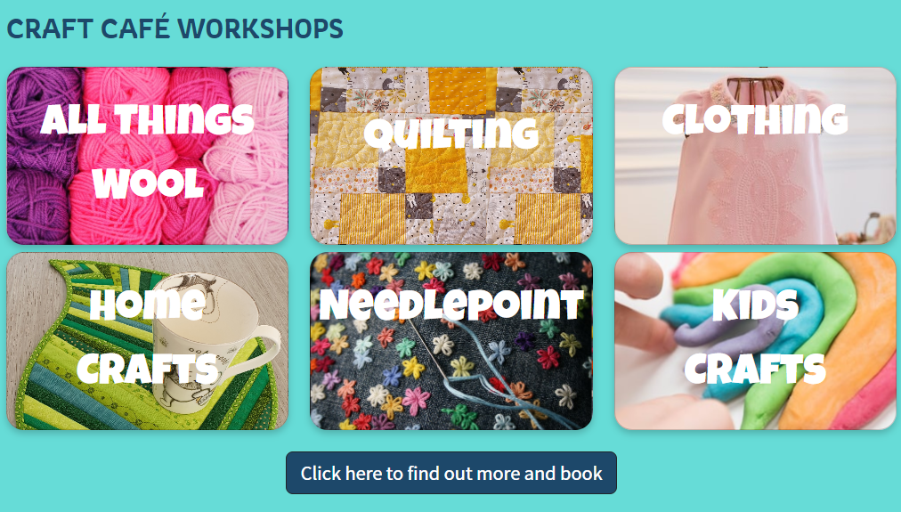

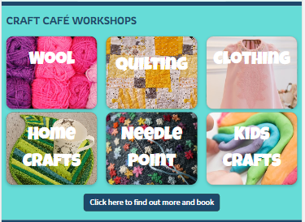

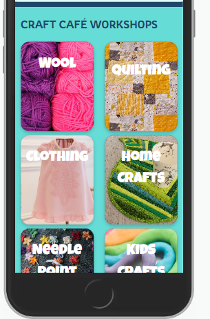

 

### **Reviews**

Scrolling down past the Workshop Overview Cards, you can read some glowing reviews from Craft Café customers. There is a mixture of reviews to cover all aspects of the products and services it provides. One review relates to the Food, one review relates to the craft workshops and the final review relates to a bespoke craft party that was held at the café.

In desktop view, the three reviews can be seen side by side in one row. In tablet and mobile view, only the first two reviews are shown, in tablet view side by side and in mobile view one above the other. 

<b>Reviews</b>

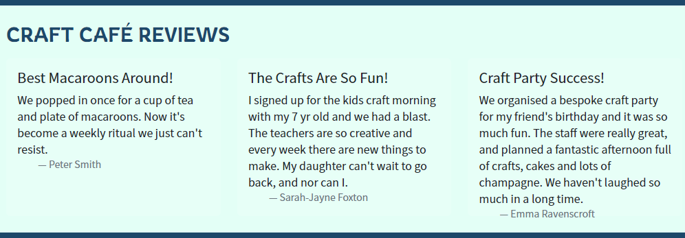

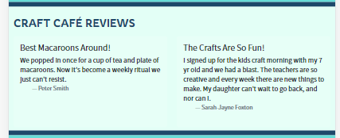

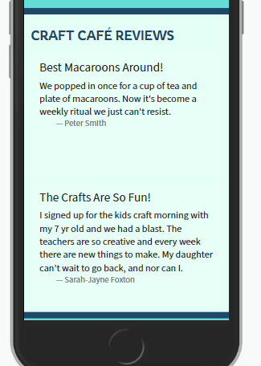

 

### **Map**
### **Craft Workshops**
### **Booking Form**
### **Craft Cafe Community**
### **Post Details Page**
### **Profile Page**
### **Admin Dashboard**
### **Sign Up**
### **Sign In**
### **Sign Out**
### **Footer**
### **Flash Messages**

### Features Left to Implement

* Email notification system for the following activities:
    * Booking confirmation to the user
    * Booking request pending confirmation to admin
* Add option for a user to submit a review about the Craft Café
* Ability to click on the comment count speech bubble to add a comment
* Success alert messages for edits and deletions carried out in the profile page

[Back to top](<#table-of-content>)

# Technologies Used

## Languages

* [Python](https://en.wikipedia.org/wiki/Python_(programming_language)) - Provides the functionality for the site.
* [HTML5](https://en.wikipedia.org/wiki/HTML) - Provides the content and structure for the website.
* [CSS3](https://en.wikipedia.org/wiki/CSS) - Provides the styling for the website.
* [JavaScript](https://en.wikipedia.org/wiki/JavaScript) - Provides interactive elements of the website

## Frameworks & Software
* [Bootstrap](https://getbootstrap.com/) - A CSS framework that helps building solid, responsive, mobile-first sites
* [Django](https://www.djangoproject.com/) - A model-view-template framework used to create the Review | Alliance site
* [Balsamiq](https://balsamiq.com/) - Used to create the wireframe.
* [Microsoft Excel](https://www.microsoft.com/sv-se/microsoft-365/excel) - Used to create testing scenarios.
* [Github](https://github.com/) - Used to host and edit the website.
* [GitBash](https://en.wikipedia.org/wiki/Bash_(Unix_shell)) - Terminal in [Gitpod](https://www.gitpod.io) used to push changes to the GitHub repository.
* [Heroku](https://en.wikipedia.org/wiki/Heroku) - A cloud platform that the application is deployed to.
* [Lighthouse](https://developer.chrome.com/docs/lighthouse/overview/) - Used to test performance of site.
* [Responsive Design Checker](https://www.responsivedesignchecker.com/) - Used for responsiveness check.
* [Wave Web Accessibility Evaluation Tool](https://wave.webaim.org/) - Used to validate the sites accessibility.
* [a11y Color Contrast Accessibility Validator](https://color.a11y.com/Contrast/) - Used to test color contrast on the site
* [Graph Models](https://django-extensions.readthedocs.io/en/latest/graph_models.html) - Used to create a *.dot file of all models in the project.
* [dreampuf](https://dreampuf.github.io/GraphvizOnline/) - Creates visually appealing database diagrams of *.dot files.
* [Favicon](https://favicon.io/) - Used to create the favicon.
* [VSCode](https://code.visualstudio.com/) - Used to create and edit the site.
* [Google Chrome DevTools](https://developer.chrome.com/docs/devtools/) - Used to debug and test responsiveness.
* [Trello](https://trello.com/en-GB) - A project management tool to organize the project.
* [Cloudinary](https://cloudinary.com/) - A service that hosts all static files in the project.
* [HTML Validation](https://validator.w3.org/) - Used to validate HTML code
* [CSS Validation](https://jigsaw.w3.org/css-validator/) - Used to validate CSS code
* [PEP8 Validation](http://pep8online.com/) - At the time for deploying this project the PEP8 Online Validaton service was offline, therefore not used.
* [JSHint Validation](https://jshint.com/) - Used to validate JavaScript code

## Libraries

[Back to top](<#table-of-content>)

The libraries used in this project are located in the requirements.txt file and have been documented below

* [asgiref](https://pypi.org/project/asgiref/) - ASGI is a standard for Python asynchronous web apps and servers to communicate with each other, and positioned as an asynchronous successor to WSGI.
* [cloudinary](https://pypi.org/project/cloudinary/) - The Cloudinary Python SDK allows you to quickly and easily integrate your application with Cloudinary. Effortlessly optimize, transform, upload and manage your cloud's assets.
* [dj3-cloudinary-storage](https://pypi.org/project/dj3-cloudinary-storage/) - Django Cloudinary Storage is a Django package that facilitates integration with Cloudinary by implementing Django Storage API.
* [Django](https://pypi.org/project/Django/) - Django is a high-level Python web framework that encourages rapid development and clean, pragmatic design.
* [django-allauth](https://pypi.org/project/django-allauth/) - Integrated set of Django applications addressing authentication, registration, account management as well as 3rd party (social) account authentication.
* [django-crispy-forms](https://pypi.org/project/django-crispy-forms/) - Used to integrate Django DRY forms in the project.
* [django-extensions](https://pypi.org/project/django-extensions/) - Django Extensions is a collection of custom extensions for the Django Framework.
* [gunicorn](https://pypi.org/project/gunicorn/) - Gunicorn ‘Green Unicorn’ is a Python WSGI HTTP Server for UNIX. It’s a pre-fork worker model ported from Ruby’s Unicorn project. The Gunicorn server is broadly compatible with various web frameworks, simply implemented, light on server resource usage, and fairly speedy.
* [oauthlib](https://pypi.org/project/oauthlib/) - OAuthLib is a framework which implements the logic of OAuth1 or OAuth2 without assuming a specific HTTP request object or web framework.
* [psycopg2](https://pypi.org/project/psycopg2/) - Psycopg is the most popular PostgreSQL database adapter for the Python programming language.
* [PyJWT](https://pypi.org/project/PyJWT/) - A Python implementation of RFC 7519.
* [pylint-django-2.5.3](https://pypi.org/project/pylint-django/) - A Pylint plugin for improving code analysis when analysing code using Django.
* [pylint-plugin-utils-0.7](https://pypi.org/project/pylint-plugin-utils/) - This is not a direct Pylint plugin, but rather a set of tools and functions used by other plugins such as pylint-django.
* [python3-openid](https://pypi.org/project/python3-openid/) - OpenID support for modern servers and consumers.
* [pytz](https://pypi.org/project/pytz/) - This is a set of Python packages to support use of the OpenID decentralized identity system in your application, update to Python 3
* [requests-oauhlib](https://pypi.org/project/requests-oauthlib/) - P    rovides first-class OAuth library support for Requests.
* [sqlparse](https://pypi.org/project/sqlparse/) - sqlparse is a non-validating SQL parser for Python. It provides support for parsing, splitting and formatting SQL statements.
* [cryptography-3.3.23](https://pypi.org/project/cryptography/3.3/) - Cryptography is a package which provides cryptographic recipes and primitives to Python developers.

# Testing

## Testing User Stories