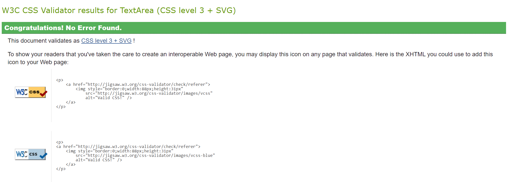
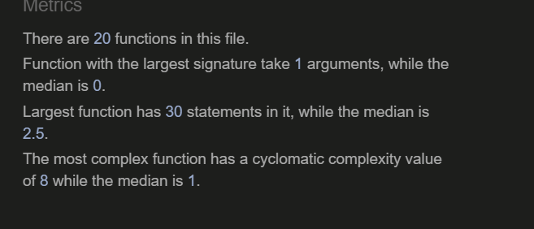
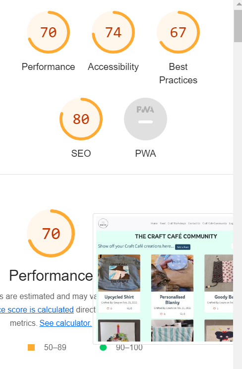

# **The Craft Café**

# Testing

# Table of Content

* [**Testing**](<#testing>)
    * [Code Validation](<#code-validation>)
    * [Manual Testing](<#manual-testing>)
    * [Automatic Testing](<#automatic-testing>)
    * [Responsiveness Testing](<#responsiveness-testing>)
    * [Known Bugs](<#known-bugs>)
    * [Additional Testing](<#additional-testing>)

## Code Validation

The Craft Café site has been passed through the [W3C html Validator](https://validator.w3.org/), the [W3C CSS Validator](https://jigsaw.w3.org/css-validator/) and the [JS Hint Validator](https://jshint.com/).

The Craft Café site has also been passed through the internal PEP8 validation tests which I installed into GitPod. The method I used to do this was as per the Slack Article written by kevin_ci on the 28th September 2022 in #announcements, since the PEP8online website no longer works:

1. Run the command 'pip3 install pycodestyle'
2. Press Ctrl+Shift+P
3. Type 'linter' into the search field
4. Select 'Python: Select Linter
5. Select 'pycodestyle' from the list
6. Select the 3 lines menu in the top left hand corner. Select 'View' and then 'Problems'. 
6. PEP8 errors are now displayed in a list as well as being underlined in red in the central editor window. 

## W3C html Validation Results

* base.html - 1 error and 1 warning found. Details can be found in the [Bugs](<#known-bugs>) section. The issues were easily fixed and after a retest, no more errors were returned.

## W3C CSS Validation Results

* Style.css – No errors were found.

## JS Hint Validation Results

* Script.js - 2 undefined variables found.  Details can be found in the [Bugs](<#known-bugs>) section. The issues were fixed and after further testing, no more errors were returned.

## PEP8 Validation Results

### Booking App py files

* admin.py - No problems or warnings found
* apps.py - No problems or warnings found
* forms.py - No problems or warnings found
* models.py - No problems or warnings found
* urls.py - No problems or warnings found
* views.py - No problems or warnings found

### Community App py files

* admin.py - No problems or warnings found
* apps.py - No problems or warnings found
* forms.py - No problems or warnings found
* models.py - No problems or warnings found
* urls.py - No problems or warnings found
* views.py - No problems or warnings found

## Manual Testing

In addition to the code validation tests stated above I have performed a series of manual tests. 

| Status | **Homepage - User Logged Out**
|:-------:|:--------|
| &check; | Clicking the navbar brand logo loads the home page
| &check; | Clicking the Home button on the nav bar re-loads the home page
| &check; | Clicking the Food button on the nav bar scrolls down to the Craft Cafe Menu section of the homepage
| &check; | Clicking the Craft Workshops button on the nav bar takes you to the top of the contact.html page
| &check; | Clicking the Contact Us button on the nav bar takes you to the booking form section on the contact.html page but the user can't see the booking form
| &check; | Clicking the Craft Cafe Community button on the nav bar takes you to the craft-community.html page with a message saying you must be logged in to view community posts. No posts can be seen.
| &check; | Clicking the Sign Up button on the nav bar loads the sign up page
| &check; | Clicking the Login button on the nav bar loads the sign in page
| &check; | The user can not see the personal profile icon in the navigation bar
| &check; | The user can not see the admin menu option in the navigation bar
| &check; | Clicking on the 'Book into a craft workshop here' button on the hero image takes you to the top of the contact.html page
| &check; | Clicking the 'Wool' button on the Craft Cafe Workshop category cards takes the user to the Mondays: All things Wool section of the Contact Page
| &check; | Clicking the 'Quilting' button on the Craft Cafe Workshop category cards takes the user to the Wednesdays: Quilting section of the Contact Page
| &check; | Clicking the 'Clothing' button on the Craft Cafe Workshop category cards takes the user to the Tuesdays: Clothing section of the Contact Page
| &check; | Clicking the 'Home Crafts' button on the Craft Cafe Workshop category cards takes the user to the Thursdays: Home Crafts section of the Contact Page
| &check; | Clicking the 'Needlepoint' button on the Craft Cafe Workshop category cards takes the user to the Fridays: Needlepoint section of the Contact Page
| &check; | Clicking the 'Kids Crafts' button on the Craft Cafe Workshop category cards takes the user to the Saturdays: Kids Crafts section of the Contact Page
| &check; | Clicking on the 'Click here to find out more and book' button takes the user to the top of the contact.html page
| &check; | Desktop users can see three reviews
| &check; | Tablet and Mobile users can see two reviews
| &check; | Google map is visible with a marker pin showing the exact location of the Craft Cafe
| &check; | Clicking the KH Designs link in the footer area opens my GitHub profile in a new window
| &check; | Clicking the Craft Cafe brand logo in the footer area takes the user back to the top of the homepage
| &check; | Clicking the Facebook link in the footer area opens Facebook in a new window
| &check; | Clicking the Twitter link in the footer area opens Twitter in a new window
| &check; | Clicking the Instagram link in the footer area opens Instagram in a new window
| &check; | Typing 'https://craft-cafe.herokuapp.com/contact/cafe-dashboard' url into the browser, the user can not access the cafe-dashboard page
| &check; | Typing 'https://craft-cafe.herokuapp.com/contact/cafe-dashboard' url into the browser, the user sees a message saying 'You must be an administrator to view this page'
| &check; | Typing 'https://craft-cafe.herokuapp.com/contact/admin-edit-booking/58' url into the browser, the user can not access the admin-edit-booking page
| &check; | Typing 'https://craft-cafe.herokuapp.com/contact/admin-edit-booking/58' url into the browser, the user sees a message saying 'You must be an administrator to amend a booking'
| &check; | Typing 'https://craft-cafe.herokuapp.com/contact/admin-delete-booking/58' url into the browser, the user can not access the admin-delete-booking page
| &check; | Typing 'https://craft-cafe.herokuapp.com/contact/admin-delete-booking/58' url into the browser, the user sees a message saying 'You must be an administrator to delete a booking'
| &check; | Typing 'https://craft-cafe.herokuapp.com/craft-community/admin-edit-post/28' url into the browser, the user can not access the admin-edit-post page
| &check; | Typing 'https://craft-cafe.herokuapp.com/craft-community/admin-edit-post/28' url into the browser, the user sees a message saying 'You must be an administrator to edit a post'
| &check; | Typing 'https://craft-cafe.herokuapp.com/craft-community/admin-delete-post/28' url into the browser, the user can not access the admin-delete-post page
| &check; | Typing 'https://craft-cafe.herokuapp.com/craft-community/admin-delete-post/28' url into the browser, the user sees a message saying 'You must be an administrator to delete a post'
| &check; | Typing 'https://craft-cafe.herokuapp.com/craft-community/admin-edit-comment/22' url into the browser, the user can not access the admin-edit-comment page
| &check; | Typing 'https://craft-cafe.herokuapp.com/craft-community/admin-edit-comment/22' url into the browser, the user sees a message saying 'You must be an administrator to edit a comment'
| &check; | Typing 'https://craft-cafe.herokuapp.com/craft-community/admin-delete-comment/22' url into the browser, the user can not access the admin-delete-comment page
| &check; | Typing 'https://craft-cafe.herokuapp.com/craft-community/admin-delete-comment/22' url into the browser, the user sees a message saying 'You must be an administrator to delete a comment'

| Status | **Contact Page - User Logged Out**
|:-------:|:--------|
| &check; | The user can view the workshop schedule for Mondays, including pricing, example activites, and session times. 
| &check; | The user can view the workshop schedule for Tuesdays, including pricing, example activites, and session times.
| &check; | The user can view the workshop schedule for Wednesdays, including pricing, example activites, and session times.
| &check; | The user can view the workshop schedule for Thursdays, including pricing, example activites, and session times.
| &check; | The user can view the workshop schedule for Fridays, including pricing, example activites, and session times. 
| &check; | The user can view the workshop schedule for Saturdays, including pricing, example activites, and session times.
| &check; | Clicking the 'Book your places here' button for any day takes the user down to the contact form section
| &check; | In the booking form section, the user can't see the booking form
| &check; | In the booking form section, the user can see a message saying 'You must be logged in to make a booking'.
| &check; | Clicking on the 'Log in Here' link takes the user to the sign in page.

| Status | **Craft Community Page - User Logged Out**
|:-------:|:--------|
| &check; | The user can't view community posts  
| &check; | The user can see a message informing them that 'You must be logged in to view community posts'.. 
| &check; | Clicking on the 'Join the Craft Cafe Community Here' link takes the user to the sign in page.

These testing scenarios fulfil the objectives set out in the initial user stories for a logged out user. 

| Status | **Homepage - User Logged In**
|:-------:|:--------|
| &check; | Clicking the navbar brand logo loads the home page
| &check; | Clicking the Home button on the nav bar re-loads the home page
| &check; | Clicking the Food button on the nav bar scrolls down to the Craft Cafe Menu section of the homepage
| &check; | Clicking the Craft Workshops button on the nav bar takes you to the top of the contact.html page
| &check; | Clicking the Contact Us button on the nav bar takes you to the booking form section on the contact.html page 
| &check; | Clicking the Craft Cafe Community button on the nav bar takes you to the craft-community.html page
| &check; | The user can't see the Log In button in the navigation bar
| &check; | The user can't see the Sign Up button in the navigation bar
| &check; | The user can see the Log Out button in the navigation bar
| &check; | Clicking the Logout button on the nav bar loads the sign out page
| &check; | The user can see the personal profile icon in the navigation bar
| &check; | The user can not see the admin menu option in the navigation bar
| &check; | Clicking the personal profile icon on the nav bar loads the user's profile page
| &check; | Clicking on the 'Book into a craft workshop here' button on the hero image takes you to the top of the contact.html page
| &check; | Clicking the 'Wool' button on the Craft Cafe Workshop category cards takes the user to the Mondays: All things Wool section of the Contact Page
| &check; | Clicking the 'Quilting' button on the Craft Cafe Workshop category cards takes the user to the Wednesdays: Quilting section of the Contact Page
| &check; | Clicking the 'Clothing' button on the Craft Cafe Workshop category cards takes the user to the Tuesdays: Clothing section of the Contact Page
| &check; | Clicking the 'Home Crafts' button on the Craft Cafe Workshop category cards takes the user to the Thursdays: Home Crafts section of the Contact Page
| &check; | Clicking the 'Needlepoint' button on the Craft Cafe Workshop category cards takes the user to the Fridays: Needlepoint section of the Contact Page
| &check; | Clicking the 'Kids Crafts' button on the Craft Cafe Workshop category cards takes the user to the Saturdays: Kids Crafts section of the Contact Page
| &check; | Clicking on the 'Click here to find out more and book' button takes the user to the top of the contact.html page
| &check; | Desktop users can see three reviews
| &check; | Tablet and Mobile users can see two reviews
| &check; | Google map is visible with a marker pin showing the exact location of the Craft Cafe
| &check; | Clicking the KH Designs link in the footer area opens my GitHub profile in a new window
| &check; | Clicking the Craft Cafe brand logo in the footer area takes the user back to the top of the homepage
| &check; | Clicking the Facebook link in the footer area opens Facebook in a new window
| &check; | Clicking the Twitter link in the footer area opens Twitter in a new window
| &check; | Clicking the Instagram link in the footer area opens Instagram in a new window
| &check; | Typing 'https://craft-cafe.herokuapp.com/contact/cafe-dashboard' url into the browser, the user can not access the cafe-dashboard page
| &check; | Typing 'https://craft-cafe.herokuapp.com/contact/cafe-dashboard' url into the browser, the user sees a message saying 'You must be an administrator to view this page'
| &check; | Typing 'https://craft-cafe.herokuapp.com/contact/admin-edit-booking/58' url into the browser, the user can not access the admin-edit-booking page
| &check; | Typing 'https://craft-cafe.herokuapp.com/contact/admin-edit-booking/58' url into the browser, the user sees a message saying 'You must be an administrator to amend a booking'
| &check; | Typing 'https://craft-cafe.herokuapp.com/contact/admin-delete-booking/58' url into the browser, the user can not access the admin-delete-booking page
| &check; | Typing 'https://craft-cafe.herokuapp.com/contact/admin-delete-booking/58' url into the browser, the user sees a message saying 'You must be an administrator to delete a booking'
| &check; | Typing 'https://craft-cafe.herokuapp.com/craft-community/admin-edit-post/28' url into the browser, the user can not access the admin-edit-post page
| &check; | Typing 'https://craft-cafe.herokuapp.com/craft-community/admin-edit-post/28' url into the browser, the user sees a message saying 'You must be an administrator to edit a post'
| &check; | Typing 'https://craft-cafe.herokuapp.com/craft-community/admin-delete-post/28' url into the browser, the user can not access the admin-delete-post page
| &check; | Typing 'https://craft-cafe.herokuapp.com/craft-community/admin-delete-post/28' url into the browser, the user sees a message saying 'You must be an administrator to delete a post'
| &check; | Typing 'https://craft-cafe.herokuapp.com/craft-community/admin-edit-comment/22' url into the browser, the user can not access the admin-edit-comment page
| &check; | Typing 'https://craft-cafe.herokuapp.com/craft-community/admin-edit-comment/22' url into the browser, the user sees a message saying 'You must be an administrator to edit a comment'
| &check; | Typing 'https://craft-cafe.herokuapp.com/craft-community/admin-delete-comment/22' url into the browser, the user can not access the admin-delete-comment page
| &check; | Typing 'https://craft-cafe.herokuapp.com/craft-community/admin-delete-comment/22' url into the browser, the user sees a message saying 'You must be an administrator to delete a comment'

| Status | **Contact Page - User Logged In**
|:-------:|:--------|
| &check; | The user can view the workshop schedule for Mondays, including pricing, example activites, and session times. 
| &check; | The user can view the workshop schedule for Tuesdays, including pricing, example activites, and session times.
| &check; | The user can view the workshop schedule for Wednesdays, including pricing, example activites, and session times.
| &check; | The user can view the workshop schedule for Thursdays, including pricing, example activites, and session times.
| &check; | The user can view the workshop schedule for Fridays, including pricing, example activites, and session times. 
| &check; | The user can view the workshop schedule for Saturdays, including pricing, example activites, and session times.
| &check; | Clicking the 'Book your places here' button for any day takes the user down to the contact form section
| &check; | In the booking form section, the user can see the booking form
| &check; | The user's username is automatically populated in the 'booking as' field
| &check; | The user can't open the 'Day' field calendar if the 'Workshop' field has not been selected first. 
| &check; | The user can view a list of the six workshop categories on clicking the 'Workshop' field dropdown selection
| &check; | The user can open the 'Day' field calendar after having selected a workshop.
| &check; | The user can't select any dates in the past
| &check; | The user can only select dates up to 5 months in the future, from today's date.
| &check; | The user can't manually type anything into the 'Day' field
| &check; | On selecting the 'All Things Wool' workshop, the user can only select Mondays from the calendar
| &check; | On selecting the 'Quilting' workshop, the user can only select Wednesdays from the calendar
| &check; | On selecting the 'Clothing' workshop, the user can only select Tuesdays from the calendar
| &check; | On selecting the 'Home Crafts' workshop, the user can only select Thursdays from the calendar
| &check; | On selecting the 'Needlepoint' workshop, the user can only select Fridays from the calendar
| &check; | On selecting the 'Kids Crafts' workshop, the user can only select Saturdays from the calendar
| &check; | On selecting the 'All Things Wool', 'Quilting', 'Clothing', 'Home Crafts' or 'Needlepoint workshop, the user can only select the afternoon options of 4 - 6pm or 6 - 8pm from the 'Time' field dropdown menu.
| &check; | On selecting the 'Kids Crafts' workshop, the user can only select the morning options of 10 - 11.30 or 11.30 till 1 from the 'Time' field dropdown menu.
| &check; | The user can view a list of the number of places they wish to book from 1 to 10 in the 'Places' field dropdown selection
| &check; | On changing the 'Workshop' field selection, the date field is reset to blank.
| &check; | On changing the 'Workshop' field selection, the Time field is reset to correspond with the selected workshop.
| &check; | On changing the 'Workshop' field selection, the Places field is reset to 1.
| &check; | Clicking 'Submit booking request', the user will see an error message alert above the contact form saying 'The selected date is full. Please try a different session', if there are already more than 10 places reserved on the same workshop session requested.
| &check; | On submitting a booking request on a session where there are not enough places available, the user is redirected back to the booking form and the fields have been reset
| &check; | Clicking 'Submit booking request', if there are enough places available, the user is redirected to the profile page so that they can see the details of the booking.
| &check; | Clicking 'Submit booking request', if there are enough places available, the user can see an alert message saying 'Booking request successful, awaiting approval'.
| &check; | On submitting a booking request with no Workshop selected, a message pops up telling the user to complete all fields
| &check; | On submitting a booking request with no date selected, a message pops up telling the user to complete all fields

| Status | **Craft Community Page - User Logged In**
|:-------:|:--------|
| &check; | The user can view all approved community posts  
| &check; | The user can view the number of likes on each post
| &check; | The user can view the number of comments on each post
| &check; | The user can click on the heart icon to like a post
| &check; | The user can filter the posts by their desired category, so that they can only see posts in one workshop category.
| &check; | Clicking on the Title of a post, the user can see the 'post-details' page
| &check; | Clicking on the 'Add a Post' button, a modal pop up appears containing the Post form.
| &check; | The author of the post form is automatically assigned as the username
| &check; | The user can no submit the form without filling in the TItle and the Content fields.
| &check; | The user can submit the form without uploading an image file
| &check; | The user can submit the form without uploading an image file
| &check; | The user can see a success message alert when the post has been successfully submitted
| &check; | The user can view their post on the craft community posts page once it has been approved by admin.

| Status | **Post Details Page - User Logged In**
|:-------:|:--------|
| &check; | The user can view additional an text description relating to one selected post 
| &check; | The user can view the number of likes on each post
| &check; | The user can view the number of comments on each post
| &check; | Clicking the 'Back to Posts' button takes the user back to the Craft Cafe Community Posts page
| &check; | The user can click on the heart icon to like a post
| &check; | The user can filter the posts by their desired category, so that they can only see posts in one workshop category.
| &check; | Clicking on the Title of a post, the user can see the 'post-details' page
| &check; | The user can view all approved comments made about this post
| &check; | The user can add a comment to this post
| &check; | The user can not submit a blank comment
| &check; | The user can see a success message once they submit a post telling them that it's awaiting approval.

| Status | **Profile Page - User Logged In**
|:-------:|:--------|
| &check; | The user can view their username and email address in the personal details section 
| &check; | clicking the 'Delete Account' button will take the user to the delete-account page
| &check; | The user can view a list of bookings they have submitted successfully
| &check; | Users who haven't made any bookings, can see a message saying they have no bookings
| &check; | Users who haven't made any bookings, clicking the 'here' link takes them to the contact page
| &check; | Users can see an 'Edit' button next to each booking made
| &check; | On clicking 'Edit' next to a booking, the user is taken to the edit-booking page
| &check; | Users can see a 'Delete' button next to each booking made
| &check; | On clicking 'Delete' next to a booking, the user is taken to the delete-booking page
| &check; | The user can view the approval status of all their bookings
| &check; | The user can view a list of posts they have submitted successfully
| &check; | Users who haven't written any posts, can see a message saying they have no posts
| &check; | Users who haven't written any posts, clicking the 'here' link takes them to the craft community page
| &check; | Clicking on the post title, the user is taken to the post-details page for that post
| &check; | Users can see an 'Edit' button next to each post made
| &check; | On clicking 'Edit' next to a post, the user is taken to the edit-post page
| &check; | Users can see a 'Delete' button next to each post made
| &check; | On clicking 'Delete' next to a post, the user is taken to the delete-post page
| &check; | The user can view the approval status of all their posts
| &check; | The user can view a list of comments they have submitted successfully
| &check; | Users who haven't written any comments, can see a message saying they have no comments
| &check; | Users who haven't written any comments, clicking the 'here' link takes them to the craft community page
| &check; | Clicking on the commented post title, the user is taken to the post-details page for that post
| &check; | Users can see an 'Edit' button next to each comment made
| &check; | On clicking 'Edit' next to a comment, the user is taken to the edit-comment page
| &check; | Users can see a 'Delete' button next to each comment made
| &check; | On clicking 'Delete' next to a comment, the user is taken to the delete-comment page
| &check; | The user can view the approval status of all their comments

| Status | **Delete Account Page - User Logged In**
|:-------:|:--------|
| &check; | The user can view their username
| &check; | clicking the 'Delete My Account' button will remove their user details from the site
| &check; | clicking the 'Delete My Account' button will redirect the user back to the homepage 
| &check; | clicking the 'Delete My Account' button will change the user into a logged out user
| &check; | clicking the 'Delete My Account' button will remove the ability to view the profile page icon on the nav bar
| &check; | clicking the 'Go Back' button will return the user to the profile page without deleting the account

| Status | **Edit Booking Page - User Logged In**
|:-------:|:--------|
| &check; | The user can view the booking form pre-populated with the existing booking data
| &check; | The user can view the booking form is being booked under their own username
| &check; | The user can edit the workshop selection
| &check; | The user can edit the date selection, based on the schedule for the selected workshop
| &check; | The user can edit the time selection, based on the schedule for the selected workshop
| &check; | The user can edit the number of places they wish to reserve
| &check; | On clicking 'Save Changes', the user is redirected back to the profile page
| &check; | On clicking 'Save Changes', the user gets a success alert saying the 'The booking has been changed successfully, awaiting re-approval'
| &check; | On clicking 'Save Changes', the user can view the updated booking request in the bookings list on the profile page
| &check; | On clicking 'Save Changes', the booking status changes to 'Awaiting approval'

| Status | **Delete Booking Page - User Logged In**
|:-------:|:--------|
| &check; | The user can view a message asking them if they are sure they want to delete the booking
| &check; | clicking the 'Delete Booking' button will remove the booking from the site
| &check; | clicking the 'Delete Booking' button will remove the booking from the profile page bookings list
| &check; | clicking the 'Delete Booking' button will redirect the user back to the profile page
| &check; | clicking the 'Go Back' button will return the user to the profile page without deleting the booking

| Status | **Edit Post Page - User Logged In**
|:-------:|:--------|
| &check; | The user can view the post form pre-populated with the existing post data
| &check; | The user can edit the Title 
| &check; | The user can edit the post category
| &check; | The user can edit the image
| &check; | The user can view the image file-name currently saved with this post
| &check; | The user can edit the post content
| &check; | On clicking 'Save Changes', the user is redirected back to the profile page
| &check; | On clicking 'Save Changes', the user gets a success alert saying the 'Post updated successfully, awaiting re-approval'
| &check; | On clicking 'Save Changes', the user can view the updated post in the posts list on the profile page
| &check; | On clicking 'Save Changes', the post approval status changes to 'Awaiting approval'

| Status | **Delete Post Page - User Logged In**
|:-------:|:--------|
| &check; | The user can view a message asking them if they are sure they want to delete the post
| &check; | The user can view the title of the post they have selected for deletion
| &check; | clicking the 'Delete Post' button will remove the post from the site
| &check; | clicking the 'Delete Post' button will remove the post from the profile page posts list
| &check; | clicking the 'Delete Post' button will remove the post from the craft cafe community posts page
| &check; | clicking the 'Delete Post' button will redirect the user back to the profile page
| &check; | clicking the 'Go Back' button will return the user to the profile page without deleting the post

| Status | **Edit Comment Page - User Logged In**
|:-------:|:--------|
| &check; | The user can view the comment form pre-populated with the existing comment data
| &check; | The user can view which post the comment relates to
| &check; | The user can edit the Comment content field
| &check; | On clicking 'Save Changes', the user is redirected back to the profile page
| &check; | On clicking 'Save Changes', the user gets a success alert saying the 'Comment updated successfully, awaiting re-approval'
| &check; | On clicking 'Save Changes', the user can view the updated comment in the comments list on the profile page
| &check; | On clicking 'Save Changes', the comment approval status changes to 'Awaiting approval'

| Status | **Delete Comment Page - User Logged In**
|:-------:|:--------|
| &check; | The user can view a message asking them if they are sure they want to delete the comment
| &check; | The user can view the title of the post which the comment relates to
| &check; | The user can view the date and time the comment was written
| &check; | clicking the 'Delete Comment' button will remove the comment from the site
| &check; | clicking the 'Delete Comment' button will remove the comment from the profile page comments list
| &check; | clicking the 'Delete Comment' button will remove the comment from the post-details post page
| &check; | clicking the 'Delete Comment' button will redirect the user back to the profile page
| &check; | clicking the 'Go Back' button will return the user to the profile page without deleting the comment

These testing scenarios fulfil the objectives set out in the initial user stories for a logged in normal user. 

A logged in Admin superuser can perform all the same functions as a normal logged in user, with one addition. A super user has access to the cafe-dashboard pages and it's respective administrative features.

| Status | **Homepage - SuperUser Logged In**
|:-------:|:--------|
| &check; | The superuser can see the admin menu option in the navigation bar
| &check; | Clicking the Admin button on the nav bar takes the superuser to the cafe-dashboard page

| Status | **Craft Cafe Admin Dashboard - SuperUser Logged In**
|:-------:|:--------|
| &check; | The superuser can view total bookings made on the site
| &check; | The superuser can view total posts made on the site
| &check; | The superuser can view total comments made on the site
| &check; | The superuser can view a list of all bookings made on the site
| &check; | If no bookings have been made, the superuser can see a message saying 'there are no bookings'
| &check; | The superuser can see an 'Edit' button next to each booking made
| &check; | On clicking 'Edit' next to a booking, the superuser is taken to the admin-edit-booking page
| &check; | The superuser can see a 'Delete' button next to each booking made
| &check; | On clicking 'Delete' next to a booking, the superuser is taken to the admin-delete-booking page
| &check; | The superuser can can view the approval status of all the bookings
| &check; | The superuser can can edit the booking approval status by clicking on the approval toggle icon
| &check; | On clicking the approval icon, it toggles between red cross (unapproved) and green tick (approved)
| &check; | On clicking the approval icon, the superuser can view a success message for 'approved' or 'unapproved'
| &check; | The superuser can view a list of all posts submitted to the site
| &check; | If no posts have been made, the superuser can see a message saying 'there are no posts yet'
| &check; | Clicking on the post title, the superuser is taken to the post-details page for that post
| &check; | The superuser can see an 'Edit' button next to each post made
| &check; | On clicking 'Edit' next to a post, the superuser is taken to the admin-edit-post page
| &check; | The superuser can see a 'Delete' button next to each post made
| &check; | On clicking 'Delete' next to a post, the superuser is taken to the admin-delete-post page
| &check; | The superuser can can the approval status of all the posts
| &check; | The superuser can can edit the post approval status by clicking on the approval toggle icon
| &check; | The superuser can view a list of all site comments submitted successfully
| &check; | If no comments have been made, the superuser can see a message saying 'there are no comments yet'
| &check; | Clicking on the commented post title, the superuser is taken to the post-details page for that post
| &check; | The superuser can see an 'Edit' button next to each comment made
| &check; | On clicking 'Edit' next to a comment, the user is taken to the admin-edit-comment page
| &check; | The superuser can can see a 'Delete' button next to each comment made
| &check; | On clicking 'Delete' next to a comment, the user is taken to the admin-delete-comment page
| &check; | The superuser can view the approval status of all each comment
| &check; | The superuser can can edit the comment approval status by clicking on the approval toggle icon

| Status | **Admin Edit Booking Page - SuperUser Logged In**
|:-------:|:--------|
| &check; | The superuser can view the booking form pre-populated with the existing booking data
| &check; | The superuser can view thename of the user who made the booking
| &check; | The superuser can edit the workshop selection
| &check; | The superuser can edit the date selection, based on the schedule for the selected workshop
| &check; | The superuser can edit the time selection, based on the schedule for the selected workshop
| &check; | The superuser can edit the number of places 
| &check; | The superuser can edit the booking approval status 
| &check; | On clicking 'Save Changes', the superuser is redirected back to the cafe dashboard page
| &check; | On clicking 'Save Changes', the superuser can view the updated booking details in the bookings list in the cafe dashboard page
| &check; | On clicking 'Save Changes', the user can view the updated booking details in the bookings list in their profile page

| Status | **Admin Delete Booking Page - SuperUser Logged In**
|:-------:|:--------|
| &check; | The superuser can view a message asking them if they are sure they want to delete this booking
| &check; | clicking the 'Delete Booking' button will remove the booking from the site
| &check; | clicking the 'Delete Booking' button will remove the booking from the cafe dashboard page bookings list
| &check; | clicking the 'Delete Booking' button will remove the booking from the profile page bookings list
| &check; | clicking the 'Delete Booking' button will redirect the user back to the cafe dashboard page
| &check; | clicking the 'Go Back' button will return the superuser to the cafe dashboard page without deleting the booking

| Status | **Admin Edit Post Page - SuperUser Logged In**
|:-------:|:--------|
| &check; | The superuser can view the post form pre-populated with the existing post data
| &check; | The superuser can view the name of the user who submitted the post
| &check; | The superuser can edit the Title 
| &check; | The superuser can edit the post category
| &check; | The superuser can edit the image
| &check; | The superuser can view the image file-name currently saved with this post
| &check; | The superuser can edit the post content
| &check; | The superuser can edit the post approval status 
| &check; | On clicking 'Save Changes', the superuser is redirected back to the cafe dashboard page
| &check; | On clicking 'Save Changes', the superuser can view the updated post in the posts list on the cafe dashboard
| &check; | On clicking 'Save Changes', the user can view the updated post in the posts list on their profile page

| Status | **Admin Delete Post Page - SuperUser Logged In**
|:-------:|:--------|
| &check; | The superuser can view a message asking them if they are sure they want to delete the post
| &check; | The superuser can view the title of the post they have selected for deletion
| &check; | The superuser can view the author of the post they have selected for deletion
| &check; | clicking the 'Delete Post' button will remove the post from the site
| &check; | clicking the 'Delete Post' button will remove the post from the cafe dashboard posts list
| &check; | clicking the 'Delete Post' button will remove the post from the user's profile page posts list
| &check; | clicking the 'Delete Post' button will remove the post from the craft cafe community posts page
| &check; | clicking the 'Delete Post' button will redirect the user back to the cafe dashboard
| &check; | clicking the 'Go Back' button will return the superuser to the cafe dashboard page without deleting the post

| Status | **Admin Edit Comment Page - SuperUser Logged In**
|:-------:|:--------|
| &check; | The superuser can view the comment form pre-populated with the existing comment data
| &check; | The superuser can view which post the comment relates to
| &check; | The superuser can view author of the comment selected
| &check; | The superuser can edit the Comment content field
| &check; | The superuser can edit the comment approval status 
| &check; | On clicking 'Save Changes', the superuser is redirected back to the cafe dashboard page
| &check; | On clicking 'Save Changes', the superuser can view the updated comment in the comments list on the cafe dashboard page
| &check; | On clicking 'Save Changes', the user can view the updated comment in the comments list on their profile page

| Status | **Admin Delete Comment Page - SuperUser Logged In**
|:-------:|:--------|
| &check; | The superuser can view a message asking them if they are sure they want to delete the comment
| &check; | The superuser can view the title of the post which the comment relates to
| &check; | The superuser can view the date and time the comment was written
| &check; | The superuser can view the author of the comment
| &check; | clicking the 'Delete Comment' button will remove the comment from the site
| &check; | clicking the 'Delete Comment' button will remove the comment from the cafe dashboard page comments list
| &check; | clicking the 'Delete Comment' button will remove the comment from the user's profile page comments list
| &check; | clicking the 'Delete Comment' button will remove the comment from the post-details post page
| &check; | clicking the 'Delete Comment' button will redirect the superuser back to the cafe dashboard page
| &check; | clicking the 'Go Back' button will return the superuser to the cafe dashboard page without deleting the comment

## Automatic Testing

Due to time constraints and the complexity of this project, I was unable to dedicate time to setting up automatic testing. I felt that my time was better spent improving the basic functionality of the website and refining the booking form validation. Manual testing over the course of the build, however, has been extensive. 

## Responsiveness Testing

The responsive design tests were carried out manually throughout the build using Google Chrome Dev Tools. I used a mobile first approach basing my initial design around the iPhone 6,7,8 (375 x 667px) which became my first media query break point. I then selected another break point at 768px for tablet devices and 992px and above for larger devices, following the bootstrap standard breakpoints. 

During the testing process I also used the [Responsive Design Checker](https://www.responsivedesignchecker.com/) website to simulate the website on several other devices. Here are my findings:

### Mobile Devices

||
iPhone 6/6s/7

375 x 667
|
Samsung Galaxy S5/6/7

360 x 640
|
Google Pixel/Nexus 5

411 x 731
|
| :- | :-: | :-: | :-: |
|Render|Pass |Pass|Pass|
|Images|Pass|Pass|Pass|
|Links|Pass|Pass|Pass|

1. (Bug #100) Testing on small devices, the footer doesn't all fit across one row. The social media links go onto a separate line and are not centred. I have added a media query to fix this and set the three elements of the footer into separate centred rows on mobile devices.

2. I realised that I had a media query for the font size of the workshop overview card buttons to reduce the font size down to 2 rem but I didn't reduce down the hover font-size so that titles were growing bigger than the containers on mouse over. Media query for reduced font size added for the hover pseudo-class. I realised later that this was not picked up through dev tools, because the hover function doesn't work when your mouse is in 'inspect' mode. 

3. The tables in the profile page and admin dashboard contain a lot of data going horizontally, and in tablet and mobile devices, the information is lost off the side of the screen. 

I added a media query for my table class of 'profile-table' and reduced down the font-size and button sizes for tablet and mobile devices. All the data fits much better on the screens now.

### Tablet Devices

||
Amazon Kindle Fire

768 x 1024
|
Samsung Galaxy Tab 10

800 x 1280
|
Apple iPad Pro

1366 x 1024

|
| :- | :-: | :-: | :-: |
|Render|Pass|Pass|Pass |
|Images|Pass|Pass|Pass|
|Links|Pass|Pass|Pass|

### Desktop Devices

||
24 “ Desktop

1920 x 1200
|
19” Desktop

1440 x 900
|
10” Notebook

1024 x 600
|
| :- | :-: | :-: | :-: |
|Render|Pass|Pass|Pass|
|Images|Pass|Pass|Pass|
|Links|Pass|Pass|Pass|

### Browser Compatibility 

The Craft Café was tested on the following browsers:

- Google Chrome
- Microsoft Edge
- Mozilla Firefox

Testing the social media links on Mozilla Firefox, I realised I had a spelling error in my link to Facebook, so I fixed this. 

I do not have any Apple devices available to carry out testing on a Safari browser. Appearance and functionality appear to be consistent throughout all browsers.

## Known Bugs

### Resolved 

1. As a result of the W3C html validation test, the base.html page had 1 error and 1 warning. 

This error suggested that the Meta charset line was too far down my head section so I moved it to the top so that it would load faster. The warning suggested that the type attribute that I had on my javascript file link was unnecessary so I removed it. 

2. As a result of the JS Hint validation test, 2 undefined variables were found.

Initially, I had a lot of missing semi-colons which were easy to add back in. Then I was left with 2 undefined variables; 
* $
* bootstrap

I created a global variable at the top of the file for the jQuery '$', and I moved the bootstrap Timeout function into the base.html file and into a Django if statement as it was causing javascript error messages in the console. I then got 1 unused variable warning caused by var 'dayDropDownValues' but if I remove this global variable, the booking form date field stops being read-only, so I have decided to leave it in place. 

As I was building the project, I logged all major bugs that could not be immediately resolved as a GitHub issue, and tracked the progress of these through the GitHub project board alongside my user stories. See my GitHub Bug Log [here](https://github.com/quiltingcode/pp4-craft-cafe/issues?q=bug)

3. (Bug #71) On the index.html page, I created three col-4 menu cards to sit in-line in one row on desktop devices, but the thirc menu card (desserts) was being pushed down onto a second line. this menu card should only drop down onto a second line when being viewed on tablet devices. 

Solution: I realised that the 'offset-md-3' class was also affecting all screens sizes medium and ABOVE so I added an additional class 'offset-lg-0', to stop this class being used for large screen sizes, and so the third menu card wasn't offset and would sit nicely next to the other cards on one row in large screen sizes.

4. (Bug #72) Whilst I was adding in the href links to my various templates, I coded  into the href link for the craft cafe community nav bar option. The site could not resolve this url, and produced an error causing the entire site to error with a debug message of "No Reverse Match - 'craft-community' not found". 

Solution: Looking in my urls.py file I had set up the name of this template as 'community' and not 'craft-community'. Once this name was changed, the nar bar link worked correctly.

5. (Bug #75) Looking at the data render for my posts, I wasn't happy with the data that was being displayed for the DateTime stamp for when the post was created. I felt that having the time displayed as well was too much information and not necessary or usual for a blog site. Perhaps for the comments where you could receive several on one particular date, but not for the post itself. 

Solution: I found that this was pulling through from the arguments setup in the model, so I changed the model field type from 'DateTime' to just 'Date'. 

6. (Bug #83) In the Django admin page, the actions drop-down is only showing delete, but not approve, which I added in the admin.py file

Solution: Checking again in the admin.py file, the approve method that I created had a typo. I had written 'def approve_comments' instead of 'def approve_bookings' to match the action name above.

7. (Bug #85) The site wass opening correctly on the homepage but if i use the /extension to manually open the contact page or /workshops page I was getting an error - page not found 404.

Solution: I amended my urls.py file paths to correct this error

8. (Bug #86) On the index.html menu section, the menu list and prices are set out in a table. The table width is wider than the menu card image, even though it's all together inside one bootstrap card. Between 768px and down to 332px, the card is not all the same width which doesn't look very good. 

Solution: I set a max width for the menu tables and updated the responsive deisgn classes and set them to be centred. Responsive design on desktop, tablet and mobile devices is much better now. 

9. (Bug #90) The index.html page jumbotron container suddenly wasn't transparent anymore, so it changed to a grey colour and didn't look nice on top of the background image. 

Solution: Whilst altering the bootstrap cdn scripts to try to get a calendar icon to display on my bootstrap datepicker widget, I seemed to have broken the bootstrap jumbotron classes. I changed the cdn scripts back and the jumbotron container went back to being transparent. I decided to leave the datepicker field with no calendar icon. 

10. (Bug #91) On the craft-community.html page, when a new post has been submitted through the 'Add a Post' button, the craft community page re-loads but it's empty. All the published posts are not rendered on the page and it's left with just the background image. 

Solution: I joined a Thursday evening Study Group session, and opened up this problem to the group, and they explained to me that my views.py file was not redirecting correctly back to render the full craft-community view, but just the template with no view data on top. Instead of having a 'redirect_field_name = "/craft-community"' I changed this to 'return redirect "craft-community"' which loads the full craft-community page view. 

11. (Bug #92) Posts were bring submitted successfully from the front end 'Add Post' form and I could see them in the admin panel but the slug-field wasn't being automatically created, and was therefore causing errors.

Solution: After researching this, I imported slugify and added a method for this into the Post model, which fixed the issue. 

12. (Bug #93 and #94) I created a view for the user profile page, which needs to display three separate lists from three separate models; the bookings list, the posts list, and the comments list. The bookings list displays correctly, but no posts or comments are showing even though the user has submitted some. 

Solution: Having done some research into this, I found that this required a get_context_data method to render multiple views to the same page. I amended the ProfilePage view to include this method, listing a context for each list I wanted to display. Now all the data renders correctly to the template. 

13. (Bug #95) New posts could be submitted correctly now through the 'Add a Post' button on the craft-community page. However, even after being approved in the Django admin panel, these posts were not being displayed on the craft-community posts page. 

Solution: On post submission, the post status was not changing from draft to published, and the posts filter only looked for published posts. I set the status to change when the post is saved in the view and now it appears on the craft-community posts page, albeit without the uploaded image (see bug #98).

14. (Bug #98) New posts are being uploaded correctly on the frontend, but the uploaded image is not being saved alongside the other post data. 

Solution: I read an article on [Section.io](https://www.section.io/engineering-education/uploading-images-to-cloudinary-from-django-application/) on using Cloudinary on the front-end, and it turns out, that uploading images to a post through the Django admin panel is different to uploading them through a front end form. I needed to add 'request.FILES' to the PostListview post method and also put a  tag at the top of the craft-comunity page. Once I had added in these missing Cloudinary settings, the images uploaded correctly. 

15. (Bug #102) Having set up the 'Delete Account' feature on the profile-page, when I went to confirm the deletion in the delete-account page I got an error message - TypeError at contact/profile-page 'AnonymousUser' object is not iterable.

Solution: Looking in the admin panel, the account was successfully deleted, so I guessed that maybe it just didn't know where to redirect to once the deletion had occurred. After changing the reverse lazy path of the DeleteView from 'profile-page' to 'home' the user was redirected back to the homepage, and logged out, and they were no longer authorised to view the profile-page, so the url path was not accessible.

16. (Bug #108) At the top of several pages there is a band of white space between the navbar and the first page container, but I'm wasn't sure why. On some pages it's bigger on some it's smaller.  I restructured my html div tags and this seems to have reduced it down a lot but there still remains about 10px of white space which doesn't look good. This seems to have appeared since I put in a flex-wrapper into the base.html file to push the footer down to the bottom of the screen on pages where they wasn't much content such as the sign in/out pages. 

Solution: Removed the mt-3 bootstrap class from the top row of all the pages which seems to clash with the flex-wrapper. All edit and delete pages, as well as the contact page seems to be displaying correctly now. Where I want to add margin at the top of the container, I have added margin to the first header tag instead. 

17. (Bug #109) Now that there are more posts on the page and it's height is bigger, the background-color css styling was not covering the full height of the page, so there wass a white space behind the post cards before the footer is reached.  Also, the footer was no longer visible at all.

Solution: Instead of trying to spread an image across the whole varying height space, I changed the background to a color and set the background-size to cover which seemed to fix the issue. 

18. (Bug #110) I wanted to use the same edit and delete pages I created for the profile page edit and delete buttons to go to, but the problem was with the redirect at the end. When the user is editing or deleting, I want them to be redirected back to their profile page afterwards. But if a superuser is editing or deleting from the admin dashboard, I wanted them to be redirected back to the admin dashboard. 

Solution: I couldn't find an easy way to set up multiple redirect paths based on which type of user it was, or where they started from, so in the end I decided to create a copy of the pages but I renamed them admin-edit and admin-delete to carry out these same functions but being redirected to a different page afterwards. I decided to make the most of the separate pages in the end, and then I was also able to add the extra feature of the superuser being able to edit the approval status within the edit page too. 

19. (Bug #111) I decidede to create a 'Go Back' button inside the delete pages so that if the user changes their mind and doesn't want to go ahead with the deletion they can click 'go back' instead of having to use the back button on the browser. However, having created the button, when I tested it, this button still seems to be confirming the deletion and would delete the object from the database. 

Solution: I moved the 'Go Back' button to sit outside the the post method form tags so that it no longer triggers the POST view function on click.  I have copied this across to delete-booking, delete-account, delete-post and delete-comment.

20. (Bug #121) I wanted to use the same images from the homepage workshop overview cards, as in the Workshop details section on the contact.html page. I gave all the images the same bootstrap img-thumbnail class so I thought this would standardize all their sizes, but it didn't. Some images which were smaller or more rectangular than square could not be manipulated by bootstrap to fit the same img container. I felt it looked a bit odd that not all the thumbnail images were the same dimensions. 

Solution: In the end, I did another search on Unsplash, and I also looked through some personal craft images of my own, and found some alternative square shaped images that fit the thumbnail container. I set media query classes on them all, and now they look a lot more uniform. 

21. (Bug #126) See Bug #91. When you submitted a booking successfully, you are redirected to the profile page all but the lists are empty even though there are valid bookings, posts and comments in the tables which should render to the page.

Solution: This was the same issue as in no. 13. My redirect in the view was only redirecting to the page, but without the view ontop. I have changed the view to return redirect ('profile-page') and now the full template with views is rendered correctly on redirect. 

22. (Bug #129) In the booking form on the contact.html page, when a workshop is selected from the first dropdown, the datepicker calendar filters itself to show the available days for that workshop.  However, if the user changes their mind and reselects an alternative workshop, the datepicker doesn't reset to show the new available dates according to the alternative workshop selected.I don't know why this field won't reset like the others. The times and the places reset but the calendar doesn't.

Solution: On clicking the workshop input dropdown field, I have created a Jvascript function called resetAllDays() where a method called 'destroy' is carried out on the datepicker widget. This resets the calendar, and then it looks again at the workshop and re-filters to show the correct days. 

23. (Bug #134) Once I added some more posts to the craft community page, I noticed that the category filter was showing multiple entries for each category. I realised it wasn't grouping the categories, but adding an instance of the category for each post that matched it in the displayed posts. 

Solution: Instead of looping through the published posts to display the categories, I decided to pull the category list directly from the model and display them all individually in the selection drop down. Now it is possible that a user selects a category where the are no corresponding posts, but then the page just displays no posts and the user can re-select an alternative category. Once the site gets up and running and has more posts, this shouldn't be an issue. 

24. (Bug #135) In the edit-page.html page, the fields come pre-populated with the existing booking data.  This causes an issue however, because the calendar only becomes active on the first click of a workshop category. But in the edit scenario, if the user doesn't want to change the workshop but only the date, the datepicker field is not available until a new workshop is selected. So you are forced to make a click to change the workshop and then change it back again if you want to stick with the same workshop but on a different date and this is not very nice UX.

Solution: Ive created a new Javascript function called 'checkFieldData', which reads the pre-populated workshop field when the page opens, and sets the calendar filter and time filter immediately, without having to re-select the workshop.

25. (Bug #136) On the booking form, the date field is not a required field, so the submit booking button can be selected and the form tries to submit before a date has been selected from the datepicker.This causes an error 500 message and a JS error in the console.

Solution: I tried to user Javascript to set the date field to required, but I think this didn't work because the field is already set as read-only (to stop users typing in dates outside of the date limits or typing something that isn't a date). I tried to change the field settings in the model, but this didn't seem to make a difference either. In the model, I did remove the default = Date.now(), so that the user can't save the booking with today's date when the workshop selected may not actually be happening today. Finally, I found an article on [Tutorialpoint.com](https://www.tutorialspoint.com/How-to-stop-form-submission-using-JavaScript) which explained how to delay the form submission until field validation had been done through Javascript. I have set up a script for this which sits at the bottom of the contact.html page, which checks that the fields have been filled in before submission. If the workshop or date field have not been selected, the user will see a Javascipt alert popup telling them to complete the form before submission. 

### Unresolved

1. (Bug #99) On the delete-booking page and the admin-delete-booking page, the details of the booking selected for deletion do not pull through to the template. The bookings details are passed through to the delete-booking page correctly, because once you click to confirm, the selected booking does get deleted. The page has been set up in the same way as the delete-post page and the delete-comment page, and these pages display the data correctly. I did not have time to get to the bottom of this issue, so in the end, I have just left the page with no data showing, and at least the user still passes through this confirmation page before the deletion is carried out, and they can still press the back button if they are not sure which booking they are deleting. 

2. (Bug #122) I wanted to create category filter on the posts page. At first I just used standard HTML syntax to create the select tags with the option tags inside. The filter box looked a bit dated and square cut, but it had a little down arrow on the right to indicate it was a dropdown box. Then after a bit more investigation, I found I could give it a bootstrap class of 'selectpicker' to style it. I added this class, and the box now looks nice and modern with rounded edges and a blue shaded border, but I seem to have lost my down arrow. I have looked into this a bit more, and this just seems to be the bootstrap styling so I have decided to stick with the modern look and feel but with no down arrow. 

3. (Bug #128) For some reason, during testing I have noticed that the like button on the craft-community page toggles correctly and counts the number of likes up and down correctly, but the heart icon doesn't change to full or empty depending on the like count. This works on the post-details page, but not on the craft community page. For the time being, as the like functionality still works, I am focusing my time on other issues that are causing bigger problems and error messsages, and then I will come back to look at this in more detail. 

4. (Bug #130) In the admin cafe dashboard page, at the top, alongside the Craft Cafe Statistics, where it displays the counts for bookings, posts and comments, I also wanted to show a count of how many users were registered on the site. I felt that this was also a reflection of how well the site was doing - how many people wanted to create an account to interact with the site. However, as the User model does not appear in the models.py file like my other custom models, as it is created automatically through AllAuth, I didn't know how to gain access to the model, to be able to write a count method for it. If I have time in future I would like to look into this further as I think the functionality and the statistic would benefit the site. For now, I have removed this column from the table as it was displaying blank. 

5. When I created a new get method into my PostList view to display a category filter feature for the posts, it seems to have over-ridden the pagination functionality, which I found wasn't working in testing when I added more posts. I tried to merge the get method into the get_context_method, but then I broke the filter and the posts display. I need to read more documentation on how to join my methods together, as there is a lot going on inside this PostList view now, and it's very complicated. When I have more time, I will fix this. 

## Additional Testing

### Lighthouse
Google Lighthouse in Chrome Developer Tools was used to test the application within the areas of *Performance*, *Accessibility*, *Best Practices* and *SEO*. I tested the *index page*, *craft workshops page*, *craft cafe community page* and *profile page*. The testing showed the following:

* Index Page - Performance: 51, Accessibility: 93, Best Practises: 67, SEO: 90
* Craft Workshops Page - Performance: 86, Accessibility: 93, Best Practises: 75, SEO: 90
* Craft Cafe Community Page - Performance: 70, Accessibility: 74, Best Practises: 67, SEO: 80
* Profile Page - Performance: 96, Accessibility: 95, Best Practises: 75, SEO: 80

In general this is OK results. The performance is affected in a negative way by external scripts (connected to i.e. Bootstrap) and the lower result on the Index page I think due to a large hero image. The site images also seem to be affecting my best practice scores throughout so this is something I may need to address in future projects and in projects in general where users upload photos.

<b>Lighthouse Index Result</b>

 

<b>Lighthouse Workshops/Contact Page</b>

 

<b>Lighthouse Community Posts Page</b>

 

<b>Lighthouse Profile Page</b>

 

### Peer Review

In addition to the above tests, I asked my peers to create a profile and interact with the site and their overall response was very positive. 
 

Please click [**_here_**](README.md) to return to the Craft Cafe README file.